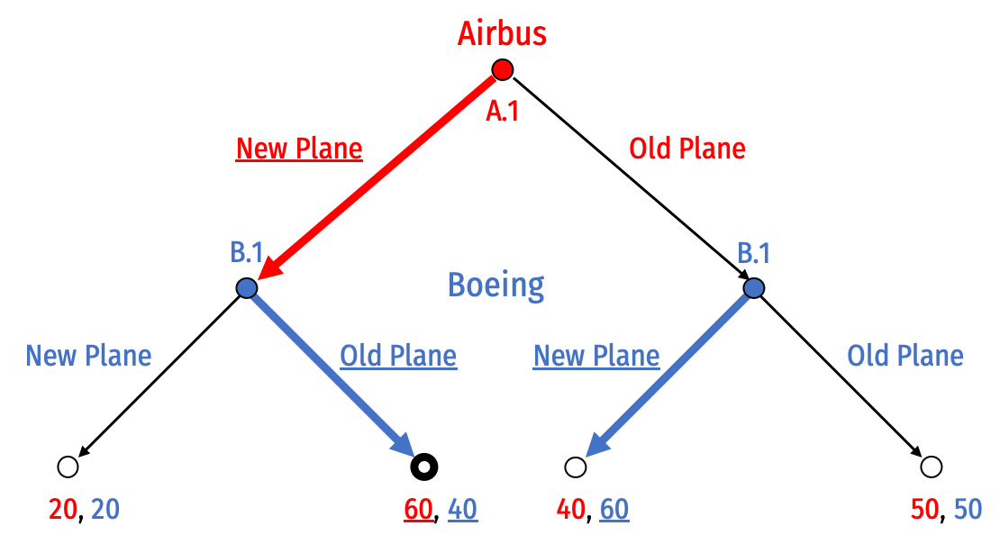
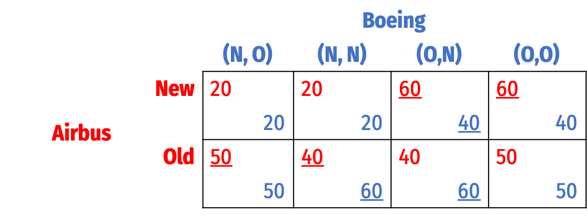
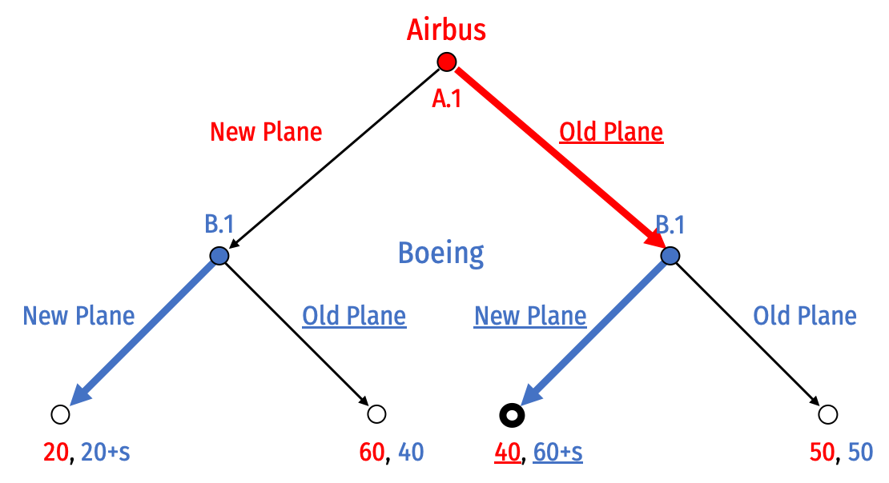

```{r setup, include=FALSE}
knitr::opts_chunk$set(echo = FALSE,
                      warning = FALSE,
                      message = FALSE)
```

Answers may be longer than I would deem sufficient on an exam. Some might vary slightly based on points of interest, examples, or personal experience. These suggested answers are designed to give you both the answer and a short explanation of why it is the answer. 

1. Explain what cartels are, the problems that they face, and some methods by which these problems might be overcome.

---

**Cartels are arrangements where sellers collude to restrict output and raise prices to act like a collective monopolist, and split the monopoly profits. It is easiest to see the difficulty of cartels by framing them as a prisoners' dilemma between two firms.**

**The Nash equilibrium is for both firms to lower price, since that is a dominant strategy for each firm. If both firms raise their price (cooperate with other firm), they can increase their profits by forming a cartel. However, this is not a Nash equilibrium, since each firm has an incentive to lower their prices and cheat the cartel if the other firm maintains a high price.**

**Cartels must find ways to enforce the agreement between members to keep prices high and outputs low. Cartel members must be able to monitor each other's behavior and detect and punish cheating or chiseling the agreement. Cartels also have to worry about competition from entrants (who are not cartel members), and detection from the government.**

**Cartels can persist only by solving these problems in one of two ways:**
- **Cartels can craft a clever coordination mechanism to secretly coordinate prices or divide up territory that all members actively pay attention to. Price-matching policies are one potential example, allowing a member to retaliate against other members that try to lower prices.**
- **Cartels can try to capture or co-opt government regulatory bodies meant to regulate them: regulators can then be influenced to fix an above-market price or divide up explusive territory and enforce it amongst all regulated firms.**

\clearpage

2. Describe the major differences between Bertrand competition, Cournot competition, and Stackelberg competition. How do firms compete, and what are the results in terms of market price, industry output, and profits for firms?

---

- Bertrand competition:
    - Firms compete *simultaneously* on *price*
    - Nash equilibrium: firms set $p=MC$ and earn no profits (competitive market outcome)
- Cournot competition:
    - Firms compete *simultaneously* on *quantity*, market price is determined by joint output
    - Nash equilibrium: firms produce same amount, earn equal (positive) profits at a high market price
- Stackelberg competition:
    - Firms compete *sequentially* on *quantity*, market price is determined by joint output
    - Nash equilibrium: 
        - *leader* produces more than Cournot-level output, earns more than Cournot-level profits
        - *follower* produces less than Cournot-level output, earns less than Cournot-level profits
        - Increased output pushes market price below Cournot level

Comparing by each metric:

- Industry output: $q_B>q_S>q_C$
- Firm profits: $\pi_{SL}>\pi_{C}>\pi_{SF}>\pi_{B}=0$
- Market price: $p_C>p_S>p_B=MC$
- where subscripts $B$=Bertrand, $C$=Cournot, $S$=Stackelberg, $L$=Leader, $F$=Follower

\clearpage

3. Describe the conditions required to make a market *contestable*. Describe and compare the Nash equilibrium of a contestable market with a pure monopoly, and with perfect competition.    

---

**In the contestable market model, an incumbent firm sets a price $p_i$ and an entrant decides to enter at $p_e$ or stay out, and consumers buy from the firm with the lower market price.**

**A market is contestable if it has:**
- **Free entry and exit**
- **Firms with similar technologies (cost structures)**
- **No sunk costs**

**The Nash equilibrium in a contestable market (with no fixed costs) attains competitive market outcomes ($p=MC$, $\pi=0$, maximum $q$, maximum consumer surplus, no deadweight loss) with a single firm.**

**With fixed costs (and therefore, economies of scale), contestable markets can attain outcomes closer to competitive markets than a monopoly, even with a single firm. In the Nash equilibirium, the incumbent successfully deters entry by setting $p=AC$ and earning no profits. This generates less than the efficient competitive outcome (higher $p$, lower $q$, less consumer surplus, some deadweight loss), but much better than the monopoly outcome.**

**If there are sunk costs, or the incumbant firm has lower costs than the entrant, the Nash equilibrium is where the incumbent sets $p_i=MC_e-\epsilon$ (prices just below the entrant's costs), we get worse outcomes (higher $p$, lower $q$, less consumer surplus, more deadweight loss), but still better than the pure monopoly outcome.**

\clearpage


4. Suppose Comcast $(C)$ and Verizon $(V)$ have a constant $MC=AC=\$20$ per customer connected to their internet network. The market (inverse) demand curve for basic internet service is given by:
$$\begin{aligned}
P&=80-2Q\\
Q&=q_C+q_V\\
\end{aligned}$$

a. Find the Cournot-Nash equilibrium output, price, and profit for each firm.

---

**Solving for Comcast, recalling that MR is twice the slope of the inverse demand curve:**
$$MR_{C}=80-4q_{C}-2q_{V}$$

**Comcast maximizes profit at $q^*$ where $MR_C=MC_1$:**

$$\begin{aligned}
MR_{C}&=MC && \text{Profit-max condition} \\
80-4q_{C}-2q_{V}&=20 && \text{Plugging in}\\
60-4q_{C}-2q_{V}&=0 && \text{Subtracting 20 from both sides}\\
60-2q_{V}&=4q_{C} && \text{Adding }4q_{C} \text{ to both sides}\\
15-0.5q_{V}&=q_{C}^* && \text{Dividing both sides by 4}\\
\end{aligned}$$
 
**Since Verizon is identical, its $q^*$ is:**
$$q_{V}^*=15-0.5q_{C}$$

**Find Nash equilibrium algebraically by plugging in one country's reaction curve into the other's:**

$$\begin{aligned}
q_{C}&=15-0.5q_{V} && \text{Comcast's reaction function}\\
q_{C}&=15-0.5(15-0.5q_{V}) && \text{Plugging in Verizon's reaction function}\\
q_{C}&=15-7.5+0.25q_{C} && \text{Distributing the }-0.5\\
q_{C}&=7.5+0.25q_{C} && \text{Subtracting}\\
0.75q_{C}&=7.5 && \text{Subtracting }0.25q_{C} \text{ to both sides}\\
q_{C}&=10 && \text{Dividing by 0.75}\\
\end{aligned}$$

**Symmetrically, $q_{V}=10$**

**This sets a market price of:**

$$\begin{aligned}
p&=80-2Q && \text{Market inverse demand function}\\
p&=80-2(10+10) && \text{Plugging in firms' output}\\
p&=40 && \text{Simplifying}\\
\end{aligned}$$

**Each firm then earns a profit of:**

$$\begin{aligned}
\pi_{C}&=q_{C}(p-c) && \text{Comcast's profit function}\\
\pi_{C}&=10(40-20) && \text{Plugging in}\\
\pi_{C}&=200 && \text{Simplifying}\\
\end{aligned}$$

Verizon symmetrically earns $\pi_{Z}=200$.

---

b. Find the output, price, and profit for each firm if the two were to collude.

---

**The two firms acting as a cartel act as a single monopolist facing the entire market demand ($p=80-2Q$), who maximizes profit by setting:**

$$\begin{aligned}
MR_{monopoly}&=MC && \text{Profit-max condition} \\
80-4Q&=20 && \text{Plugging in}\\
60-4Q&=0 && \text{Subtracting 20 from both sides}\\
60&=4Q && \text{Adding }4Q \text{ to both sides}\\
15&=Q^* && \text{Dividing both sides by 4}\\
\end{aligned}$$

**The total industry output is 15, meaning each firm produces 7.5 units. This sets a market price of**

$$\begin{aligned}
p&=80-2Q && \text{Market inverse demand function}\\
p&=80-2(15) && \text{Plugging in countries' output}\\
p&=50 && \text{Simplifying}\\
\end{aligned}$$

**The cartel then earns a profit of:**

$$\begin{aligned}
\pi_{1}&=Q(p-c) && \text{Firm 1's profit function}\\
\pi_{1}&=15(50-20) && \text{Plugging in}\\
\pi_{1}&=450 && \text{Simplifying}\\
\end{aligned}$$

**Since the two firms split the cartel profits, each firm earns a profit of \$225.**

\clearpage

c. Suppose now Comcast is a Stackelberg leader. Find each firm's output, price, and profit.

---

**Substitute the Verizon (follower)'s reaction function into market (inverse) demand function**

$$\begin{aligned}
P&=80-2q_{C}-2q_V && \text{The inverse market demand function}\\
P&=80-2q_{C}-2(15-0.5q_{C}) && \text{Plugging in Firm 2's reaction function for} q_V\\
P&=80-2q_{C}-30+1q_{C} && \text{Multiplying by }-2\\
P&=50-q_{C} && \text{Simplifying the right}\\
\end{aligned}$$

**Find $MR_C$ for Comcast from market demand:**

$$MR_{C}=104-2q_{C}$$

$$\begin{aligned}
MR_C&=MC && \text{Profit-max condition}\\
50-2q_{C}&=20 && \text{Plugging in}\\
50&=20+2q_{C} && \text{Adding }2q_{C} \text{ to both sides}\\
30&=2q_{C} && \text{Subtracting 20 from both sides}\\
15&=q_{C}^* && \text{Dividing both sides by 2} \\
\end{aligned}$$

**Verizon will respond to Comcast producing 15 according to Verizon's reaction function:**
$$\begin{aligned}
q_V^*&=15-0.5q_{C}\\
q_V^*&=15-0.5(15)\\
q_V^*&=15-7.5\\
q_V^*&=7.5\\
\end{aligned}$$

**With $q^*_{C}=15$ and $q^*_V=7.5$, this sets a market price of:**

$$\begin{aligned}
P&=80-2Q\\
P&=80-2(15+7.5)\\
P&=35\\
\end{aligned}$$

**Profit for Comcast (leader) is:**

$$\begin{aligned}
\pi_{C}&=q_{1}(P-c)\\
\pi_{C}&=15(35-20)\\
\pi_{C}&=\$225\\
\end{aligned}$$

**Profit for Verizon (follower) is:**

$$\begin{aligned}
\pi_{C}&=q_{2}(P-c)\\
\pi_{C}&=7.5(35-20)\\
\pi_{C}&=\$112.50\\
\end{aligned}$$

**The leader (Comcast) earns higher than Cournot profits (part a), and the follower (Verizon) earns less than Cournot profits.**

\clearpage

d. Find the output, price, and profit for each firm they were to compete on *price* instead of *quantity.*

---

**Under Bertrand competition, the Nash equilibrium is the competitive market outcome, where firms set:**

$$\begin{aligned}
p&=MC && \text{Competitive market condition}\\
80-2Q&=20 && \text{Plugging in}\\
60-2Q&=0 && \text{Subtracting 20 from both sides}\\
60&=2Q && \text{Adding }2Q \text{ to both sides}\\
30&=Q && \text{Dividing both sides by 2}\\
\end{aligned}$$

**The total industry output is 30, so each firm is producing 15 units. Since $p=MC$, the market price is \$20, and each firm earns $\pi=0$.**

---
\clearpage

5. What makes a threat credible? In your answer, use the concept of subgame perfection.

---

**A threat (or a promise, for that matter) is not credible if the threatened strategy is not _incentive-compatible_ for the threatener if the subgame is reached where they must carry out the promise or threat and it is not in their interest to do so. In other words, a threatened/promised strategy is not credible unless it is _subgame perfect_ -- it would be a Nash equilibrium for the player to carry out the threat or promise in the relevant subgame.**

**Promises and threats can be made credible with _commitment_ that changes the payoffs or available moves to the threatener/promisor such that they will indeed choose to carry out the promise or threat if that subgame were reached.**

**A Nash equilibrium set of strategies is _subgame perfect_ if it is sequentially rational: the pair of strategies must be a Nash equilibrium in every possible subgame. That is, if any subgame were reached, neither player would want to deviate from their strategy.**

**In short, subgame perfection rules out threats or promises that are not credible, i.e. if the relevant subgame were reached, players would want to change their announced strategy to the _SPNE_ strategy**

---

\clearpage 

6. Boeing (a U.S. company), and Airbus (a European company) are fierce competitors that together, about evenly dominate the market for aircraft. Airbus decides whether it is going to launch a *new plane*, or keep its *old planes*. Boeing must then respond and determine if it is also going to launch a *new plane* or keep its *old planes*. 

> Developing a new plane is very expensive. If both companies produce *new planes*, they will have spent a lot on producing the new plane, but neither will gain any market share. If only one company releases a new plane, they will capture more of the market, making the extra cost of development worthwhile. This game is depicted in extensive form below:


a. List all of Airbus' possible strategies and list all of Boeing's possible strategies.

---

Airbus has one decision between two choices at node A.1, thus it has $2^1$ strategies possible:

1. (New Plane)
2. (Old Plane)

Boeing has two decisions (each between two choices) at node B.1 and B.2, thus it has $2^2=4$ strategies possible (B.1, B.2):

1. (New Plane, New Plane)
2. (New Plane, Old Plane)
3. (Old Plane, New Plane)
4. (Old Plane, Old Plane)

---

b. Circle (or describe) all of the subgames of this game.

---


1. Subgame initiated at decision node A.1 (the game itself)
2. Subgame initiated at decision node B.1
3. Subgame initiated at decision node B.2

---

c. Solve for the "rollback equilibrium" using backwards induction.

---



**Airbus will build a New Plane, and Boeing will use its Old Plane.**

---

d. Draw this game in normal form. Find all Nash equilibria.^[Hint: think carefully about the players' strategies, as you listed out in Part A.] Which is subgame perfect, and why?

---



**Note Boeing's strategies are described as "O" (Old) or "N" (New), written as Boeing's set of decisions at nodes (B.1,B.2).**

**There are two Nash equilibria, written as $\{$Airbus' strategy, Boeing's strategy$\}$:**

1. $\{$New, (Old, New)$\}$
2. $\{$Old, (New, New)$\}$

**Only 1. is subgame perfect. To see why 2. is _not_, see the next question.**

---

e. Suppose Boeing, who has to move second, announces the following threat to Airbus makes its initial decision: *if Airbus produces a new plane, Boeing will respond by also producing a new plane.* Is this threat credible? Why or why not?

---

**This threat is _not_ credible. If play ever reaches the subgame at decision node B.1 (where Airbus has produced a New Plane), it is always in Boeing's interests to use their Old Plane. Boeing would thus not want to carry out its threat of also producing a New Plane.**

**This is in effect, testing the subgame perfection of the second Nash equilibrium. Boeing's strategy in that Nash equilibrium is to _always_ launch a new plane. But if the game reaches node B.1, this strategy is not a Nash equilibrium in that subgame: Boeing would want to switch its strategy to Old Plane to respond to Airbus' New Plane.**

---

f. The U.S. government considers the aircraft industry to be of strategic importance. Suppose Boeing lobbies the government to gain a subsidy to produce the plane. Boeing's payoff increases by $s$ only when it chooses to produce the new plane. How big must $s$ need to be in order to make Boeing's threat in Part e credible?

---



**Change Boeing's payoffs each time it produces a New Plane to add $+s$. We are not concerned about the outcome where Airbus plays Old Plane and Boeing playds New Plane - Boeing was always going to play New Plane at node B.2.**

**What we need to look at is node B.1 (where Airbus plays New Plane). Originally, it was in Boeing's interest to use its Old Plane, since $40>20$ for Boeing. But now, Boeing gets a subsidy if it produces New Plane, so we really need:**

$$\begin{aligned}
20+s&>40\\
s&>20 \\
\end{aligned}$$

**If the subsidy $s>20$, then it's in Boeing's interest to produce a New Plane to respond to Airbus' New Plane, since it's payoff is now higher than its Old Plane. In fact, this threat becomes credible enough that now it is no longer in Airbus' interest to produce a New Plane (and earn 20, with Boeing's New Plane), it would rather use its Old Plane (it knows Boeing will respond with New Plane at B.2) and earn 40.**